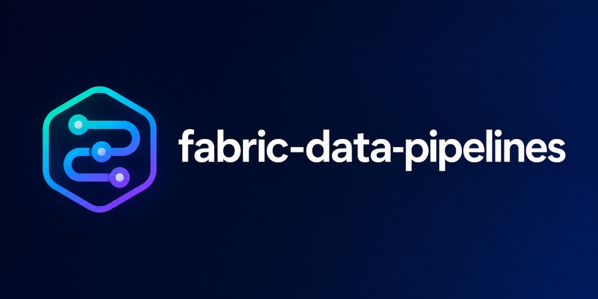

<div class="fdp-hero" markdown="0">
  
</div>
[Get started](getting-started.md){ .md-button .md-button--primary }
[API reference](reference/index.md){ .md-button }

`fabric-data-pipelines` is a Python library for building Microsoft Fabric data pipelines as code.

Fabric pipelines are JSON definitions under the hood. This library lets you work at a higher level: compose typed Python activities, wire dependencies in code, validate the graph, and export either raw pipeline JSON or Fabric Git item folders.

## Why teams use it

- Avoid hand-authoring nested Fabric pipeline JSON.
- Keep pipeline definitions in Git as code.
- Reuse patterns for orchestration, ETL, and scheduling.
- Generate the folder structure Fabric expects for Git integration.
- Catch dependency and graph mistakes before export.

## Before / after

=== "JSON (~200 lines)"

    ~~~json
    
    ~~~


=== "Python (70 lines)"

    ```python
    from fabric_data_pipelines import (
        AzureSqlMITable, ColumnMapping, ColumnRef, Copy, ExternalReferences,
        LibraryVariable, Pipeline, Script, ScriptBlock, SqlMISink, SqlMISource,
        TabularTranslator, TypeConversionSettings, expr,
    )

    LANDING = expr.library_variable("Demo_ETL_Library_Landing")
    SOURCE = expr.library_variable("Demo_ETL_Library_SourceDb")
    COLUMNS = ["customer_id", "region", "segment", "updated_at"]

    truncate = Script(
        name="Truncate_Landing_customers",
        database="Landing",
        scripts=[ScriptBlock(
            text={"value": "TRUNCATE TABLE sales.customers", "type": "Expression"},
            type="Query",
        )],
        external_references=ExternalReferences(connection=LANDING),
    )
    copy = Copy(
        name="Copy_customers_to_Landing",
        source=SqlMISource(
            sql_reader_query=SELECT_SQL,
            dataset_settings=AzureSqlMITable(database="SourceDb", connection=SOURCE),
        ),
        sink=SqlMISink(
            write_behavior="insert",
            dataset_settings=AzureSqlMITable(
                database="Landing", schema_name="sales", table="customers", connection=LANDING,
            ),
        ),
        translator=TabularTranslator(
            mappings=[
                ColumnMapping(
                    source=ColumnRef(name=col, type="String", physical_type="nvarchar"),
                    sink=ColumnRef(name=col, type="String", physical_type="nvarchar"),
                )
                for col in COLUMNS
            ],
            type_conversion=True,
            type_conversion_settings=TypeConversionSettings(allow_data_truncation=True),
        ),
    )
    truncate.then(copy)
    pipeline = Pipeline(name="Landing_customers", activities=[truncate, copy], ...)
    ```

Full runnable source: [`examples/landing_truncate_copy.py`](https://github.com/datalyft/fabric-data-pipelines/blob/main/examples/landing_truncate_copy.py).

## What you can build

This package supports both simple and production-style workflows:

- quick pipelines such as `Wait -> Notebook`
- ETL and ELT flows using `Copy`, `Script`, `Lookup`, and `ExecutePipeline`
- control flow with `IfCondition`, `ForEach`, `Switch`, and `Until`
- scheduled pipeline items with `.schedules`
- Git-backed Fabric items with stable `.platform` metadata

## Two output modes

### Raw definition output

Use `Pipeline.to_json()` or `Pipeline.save()` when you need the pipeline definition itself.

### Fabric Git item output

Use `Pipeline.save_item()` or `save_workspace()` when your repository is the source of truth and Fabric should consume `*.DataPipeline/` folders.

## Start here

- Read [Getting Started](getting-started.md) for the first pipeline.
- Read [Deploy to Fabric](guides/deploy.md) to close the loop with Git sync.
- Read [Migrate from Fabric](guides/migrate.md) to turn UI/Git pipelines into Python source.
- Read [Exporting](concepts/exporting.md) to understand JSON vs item-folder output.
- Read [Importing](concepts/importing.md) to load existing Fabric items into typed Python.
- Read [ETL Patterns](guides/etl-patterns.md) for real-world landing, ELT, schedule, and lock examples.
- Read [How this compares](guides/positioning.md) vs the UI, fabricflow, fabric-cicd, and Terraform.
- Browse the [API Reference](reference/index.md) for the public surface by concept.
- Browse [GitHub Issues](https://github.com/datalyft/fabric-data-pipelines/issues) for planned work and to request features.

<p class="fdp-sponsor">
  Sponsored by <a href="https://datalyft.io">datalyft</a>
</p>